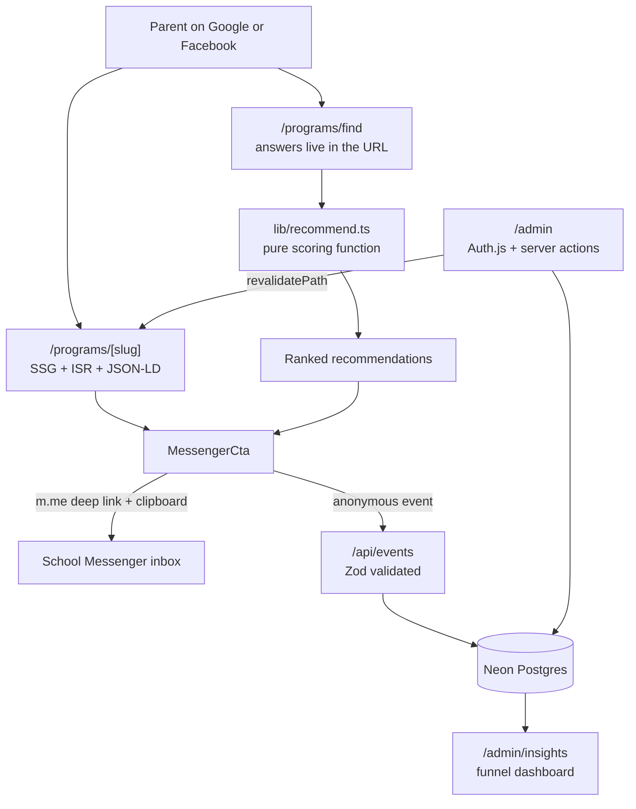

# St. Claire School of Music and Performing Arts

A full-stack enrolment platform for a real performing-arts school in Minglanilla, Cebu. The
school takes every enquiry through Facebook Messenger, so instead of adding a contact form
nobody would read, this project makes the Messenger channel work better: it publishes the
answers parents keep asking for, pre-qualifies the conversation before it starts, and gives the
owner data about the demand she previously could only guess at.

Built with Next.js App Router, Postgres, and Prisma. The marketing pages are statically
generated and indexable; the school edits its own content through an authenticated admin.

---

## The constraint that shaped everything

> "We don't want a contact form. Parents message us on Facebook."

That is a reasonable position, not a limitation to design around. The staff are already in
Messenger during opening hours; a web form would create a second inbox nobody watches. So the
brief became: **keep Messenger as the only intake channel, and make each conversation start
further along.**

Every architectural decision follows from that. There is no form, no email pipeline, and no
CRM. There is a recommendation engine, real content pages, and a funnel dashboard.

## Problems, and what was built for each

| The school's problem                                                                                               | What the site does about it                                                                                                                           |
| ------------------------------------------------------------------------------------------------------------------ | ----------------------------------------------------------------------------------------------------------------------------------------------------- |
| Staff answer the same three questions on every enquiry: how old must my child be, when are classes, how much is it | Ages, class times, live seat counts, and tuition are published on each program page                                                                   |
| Google could not index any program: the old site rendered programs in a modal inside a client-only SPA             | 11 statically generated `/programs/[slug]` pages with `Course` and `BreadcrumbList` structured data, a generated sitemap, and per-program share cards |
| Parents did not know which program suited their child, so the first Messenger exchange was an interview            | A four-question finder that scores programs against age, interest, experience, and preferred days                                                     |
| inquiries arrived with no context                                                                                  | Every Messenger button composes the parent's own message and copies it to their clipboard as the thread opens                                         |
| Staff needed a developer to change a price or a class time                                                         | Authenticated admin with server-action CRUD; saving revalidates the affected static pages                                                             |
| The owner had no idea which programs drove interest, or when                                                       | Anonymous funnel events power a dashboard showing inquiries by program, source, and weekday                                                           |

## Architecture



## Stack

| Layer      | Choice                                                                              |
| ---------- | ----------------------------------------------------------------------------------- |
| Framework  | Next.js 16 (App Router, React 19, Turbopack)                                        |
| Language   | TypeScript, strict                                                                  |
| Styling    | Tailwind CSS with a custom design system, Framer Motion                             |
| Data       | Neon Postgres via Prisma 7 driver adapters                                          |
| Auth       | Auth.js v5 credentials, bcrypt hashes, JWT sessions                                 |
| Validation | Zod, shared between client and server                                               |
| Charts     | Recharts, server-aggregated data                                                    |
| Testing    | Vitest (40 unit tests), Playwright + axe-core                                       |
| CI         | GitHub Actions: typecheck, lint, unit, e2e against real Postgres, Lighthouse budget |

## Decisions and trade-offs

**Next.js instead of staying on Vite.** The deciding factor was indexability. Programs are the
product, and they were invisible to search engines. Server rendering also put the API routes,
admin, and database in a single deployment rather than requiring a separate backend. The cost
was a migration, kept small because the existing components were presentational: most needed
only a `"use client"` directive and a swap from `react-router-dom` to `next/link`.

**The recommendation engine is a pure function.** `lib/recommend.ts` takes programs and four
answers and returns ranked results. No I/O, no dates, no randomness. That is what makes 16 unit
tests possible, including the case that matters most in practice: a child younger than every
program's minimum, where returning an empty list would dead-end the parent. It returns the
nearest-eligible programs and the age they open up instead.

**Finder answers live in the URL, not in state.** `?age=6&interest=movement&exp=none&when=weekend`
means a result is shareable, the Back button behaves, and there is no second source of truth to
keep in sync. It also means the deep-linked case is trivially testable.

**Class times are stored as `dayOfWeek` + minutes from midnight, not `DateTime`.** These are
recurring wall-clock patterns in Asia/Manila, not instants. The Philippines observes no daylight
saving, so this representation stays unambiguous and formatting never touches a timezone
library.

**Open seats are derived, never stored.** `capacity - enrolledCount` cannot drift out of sync
with itself. Zod rejects `enrolledCount > capacity` rather than clamping it, because silently
correcting the number would hide the mistake from the person who made it — and parents are
being shown that number.

**Messenger cannot pre-fill a message, so the clipboard does.** `m.me` links accept only a `ref`
payload, which is read by page automation rather than shown to the parent. The honest solution
is to compose the message, copy it on click, and tell the parent to paste. Discovering that
constraint changed the design; pretending otherwise would have shipped a broken promise.

**Retiring instead of deleting.** Removing a class time sets `isActive: false`, so historical
`InquiryEvent` rows still reference something real. Program slugs cannot be edited in the admin
at all: they are indexed and pasted into Messenger threads, so renaming one is a migration, not
an edit.

**Every server action re-checks the session.** The `/admin` proxy gate is for user experience.
Server actions are independently addressable endpoints, so each calls `requireAdmin()` itself.
Trusting the route matcher alone breaks the moment the matcher changes.

**The database is optional.** Without `DATABASE_URL` the public site serves the same seed
content that `prisma/seed.ts` writes, so `next build`, CI, and a fresh clone all work with no
secrets. Admin reads deliberately do _not_ fall back: staff must never be shown seed content
that looks editable but is not.

## Privacy by design

The school already holds families' details in Messenger, so this product stores none of them.
`InquiryEvent` has no field for a name, phone number, or email, and a child's age is recorded
only as a bucket (`5-6`, `7-9`). The dashboard is aggregate-only. This was a schema decision
rather than a policy document: the data cannot leak because it was never collected.

## Verifying the claims

Everything below is enforced in CI rather than asserted here.

```bash
npm run typecheck   # tsc --noEmit, strict
npm run lint        # oxlint
npm run test        # 40 Vitest unit tests
npm run test:e2e    # Playwright: finder flow, SEO output, axe on 6 routes
```

- **Accessibility** is asserted with `axe-core` on `/`, `/programs`, `/programs/piano`,
  `/programs/find`, `/faq`, and `/visit`, with zero WCAG 2.1 A/AA violations required to pass.
- **Performance and SEO** are gated by Lighthouse CI (`lighthouserc.json`): performance ≥ 0.9,
  accessibility 1.0, SEO 1.0, LCP ≤ 2.5s, CLS ≤ 0.1, TBT ≤ 200ms.
- **Indexable pages** went from 1 (a single client-rendered shell) to 19 static routes,
  including 11 program pages, each with its own metadata, structured data, and share card.
- **Admin-to-public revalidation** is covered by an end-to-end test that edits a description in
  the admin and asserts the change appears on the statically generated public page.

Real-world funnel numbers — enquiry volume, the share arriving pre-qualified, view-to-Messenger
conversion — are instrumented and visible at `/admin/insights`, but will only be meaningful
after launch. They are deliberately not quoted here.

## Running locally

```bash
cd stclaire
npm install
npm run dev          # works immediately, no database required
```

To enable the admin and analytics:

```bash
cp .env.example .env     # set DATABASE_URL, AUTH_SECRET, ADMIN_EMAIL, ADMIN_PASSWORD
npx prisma generate
npm run db:push
npm run db:seed          # seeds programs, testimonials, gallery, and the first admin user
```

`AUTH_SECRET` can be generated with `npx auth secret`. Sign in at `/login`.

## Project structure

```
stclaire/
├── prisma/
│   ├── schema.prisma          # Program, ClassSlot, TuitionTier, Testimonial, GalleryItem, InquiryEvent, User
│   └── seed.ts                # idempotent upserts from src/data
├── src/
│   ├── app/
│   │   ├── (site)/            # public pages, own chrome
│   │   ├── admin/             # auth-gated CRUD, insights, server actions
│   │   ├── api/events/        # anonymous funnel ingestion
│   │   ├── login/
│   │   ├── sitemap.ts, robots.ts, opengraph-image.tsx
│   ├── components/            # presentational + admin form components
│   ├── lib/
│   │   ├── recommend.ts       # pure scoring engine (unit tested)
│   │   ├── messenger.ts       # deep-link and message composition (unit tested)
│   │   ├── schedule.ts        # wall-clock time helpers, overlap detection (unit tested)
│   │   ├── analytics.ts       # server-side funnel aggregation
│   │   ├── content.ts         # read layer with seed fallback
│   │   └── privacy.ts         # age bucketing
│   ├── auth.ts, auth.config.ts, proxy.ts
│   └── data/                  # seed content, also the no-database fallback
└── e2e/                       # Playwright specs including axe scans
```

## Deliberately out of scope

Interviewers probe this harder than feature lists, so:

- **No teacher-availability model.** Week-to-week teacher absences are communicated verbally and
  in Messenger. Modelling them would have created a second schedule that staff had no reason to
  keep accurate, and a stale schedule is worse than none. Seat counts are modelled because staff
  already track them; absences are not.
- **No online payments.** The school collects tuition in person and by transfer. Payments would
  add PCI scope and reconciliation work for no benefit the school asked for.
- **No student portal or attendance tracking.** Out of the brief, and it would compete with how
  teachers already work.
- **No CMS for FAQ copy.** FAQs are stable editorial text, so they live in the codebase and feed
  `FAQPage` structured data. Putting them behind CRUD would add a surface nobody would use.

## Before launch

Two pieces of content are realistic placeholders and need the school's confirmation:

- **Tuition amounts and class capacities** in `src/data/programs.ts`. Editable through
  `/admin/programs` once the database is connected.
- **Phone number and Facebook page handle** in `src/lib/site.ts` / `NEXT_PUBLIC_MESSENGER_HANDLE`.

Additional real photographs sit in `src/assets` and can be published through `/admin/gallery`
once the school confirms captions and consent for images featuring minors.
